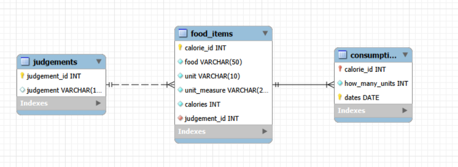

# Assignment 07: DDL Statements, Constraints, and Table Modifications

This assignment covers database and table creation, data definition language (DDL) statements, implementation of primary and foreign keys via `ALTER TABLE`, check and unique constraints, data loading (`INSERT` with `DEFAULT` and `STR_TO_DATE`), and relational query solutions using MySQL Workbench and Murach's MySQL concepts (Chapters 10 & 11).

## Database Overview

- **RDBMS / Tool:** MySQL / MySQL Workbench

- **Sample Schema:** `food_tracking_db`

- **Core Tables:** `judgements`, `food_items`, `consumption`

---

The database diagram is located at `docs/food_tracking_erd.png`.



---

## Repository Structure

```text
Assignment_07_DDL_Statements/
├── docs/
│   ├── DDL_Statements_Worksheet.docx            # Submission report with answers, code, and result screenshots
│   └── food_tracking_erd.png                    # Relational schema ERD diagram
├── scripts/
│   ├── 01_create_and_load_food_tracking_db.sql  # Database creation, table DDL, ALTER TABLE constraints, and data loading
│   └── 02_worksheet_queries.sql                 # SELECT query solutions for worksheet tasks
└── README.md
```
---

# Tasks Summary

* **Task 1: Primary Keys Identification** 
  Determines and documents the primary keys for each table (`judgements`, `food_items`, and the composite primary key `(calorie_id, dates)` for `consumption`).

* **Task 2: Foreign Keys Relational Mapping**  
  Identifies foreign key constraints linking `food_items` to `judgements` (`judgement_id`) and `consumption` to `food_items` (`calorie_id`).

* **Task 3: ENUM Data Type Analysis**  
  Evaluates where `ENUM` data types would be appropriate for restricted categorical columns such as `judgement` and `unit_measure`.

* **Task 4: Additional Constraints Implementation (`ALTER TABLE`)**  
  Applies non-key constraints after table creation, including foreign keys, composite primary keys, and a `CHECK` constraint ensuring `how_many_units > 0`.

* **Task 5: Database and Table Creation (DDL)** 
  Executes `CREATE DATABASE` and `CREATE TABLE` statements for the `food_tracking_db` schema with appropriate data types, `AUTO_INCREMENT`, `UNIQUE`, and `NOT NULL` rules.

* **Task 6: Data Population (DML)**  
  Loads initial records into `judgements`, `food_items`, and `consumption` using `INSERT` statements with `DEFAULT` for auto-increment fields and `STR_TO_DATE()` for American date formatting.

* **Task 7: Food Items Judgement Retrieval (`JOIN`)**  
  Retrieves the text judgement (instead of the ID) for each food item using an inner join between `food_items` and `judgements`.

* **Task 8: Specific Date Consumption Query (`WHERE` & `JOIN`)**  
  Queries consumed food items specifically for October 4 (`10/4/2025`) using multi-table joins across `food_items`, `consumption`, and `judgements`, filtered by month and day functions.

---

## How to Run

### Using MySQL Workbench (GUI)
1. Open **MySQL Workbench** and establish a connection to your local MySQL server.

2. Create and initialize the `food_tracking_db` database environment.
3. Open and execute `scripts/01_create_and_load_food_tracking_db.sql` sequentially to create tables, apply constraints via `ALTER TABLE`, and load initial sample records using `DEFAULT` and `STR_TO_DATE()`.
4. Open and execute `scripts/02_worksheet_queries.sql` to run the required `SELECT` queries (including inner joins and date filters) for the assignment tasks.
5. Verify your live results and table structures against the compiled worksheet report and execution screenshots available in the `docs/` folder.
